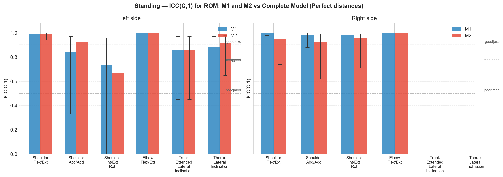
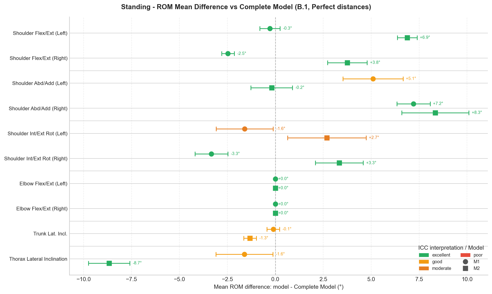
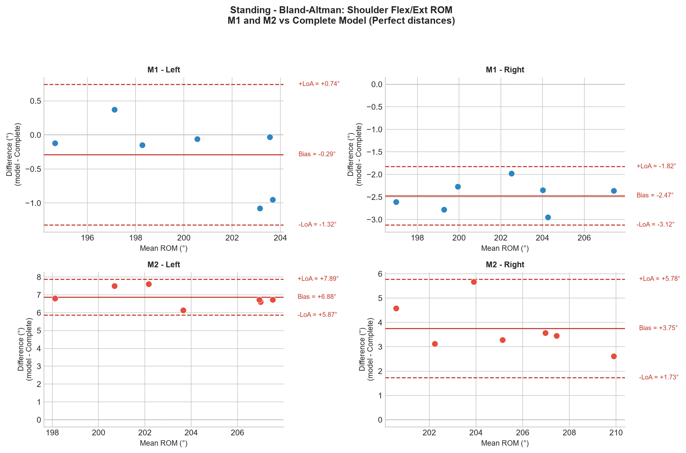
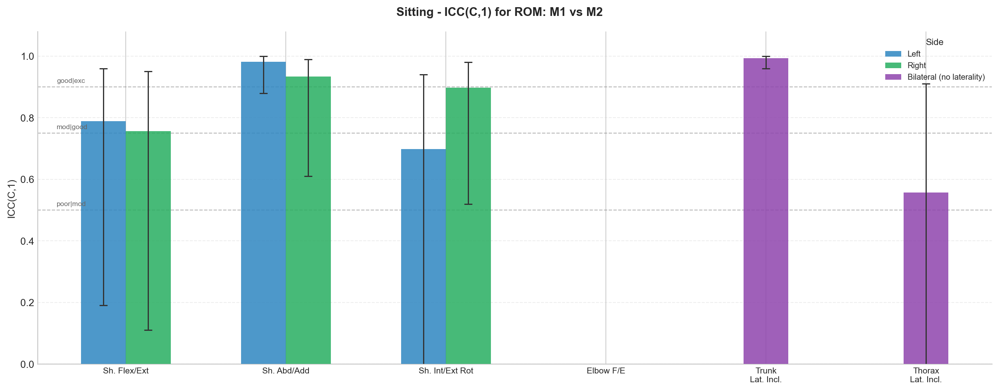
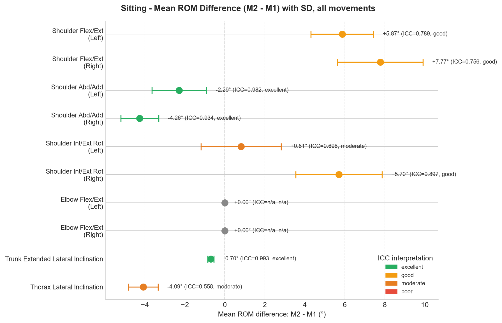
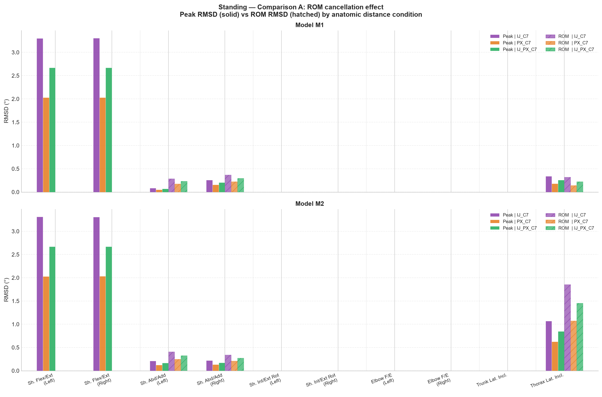
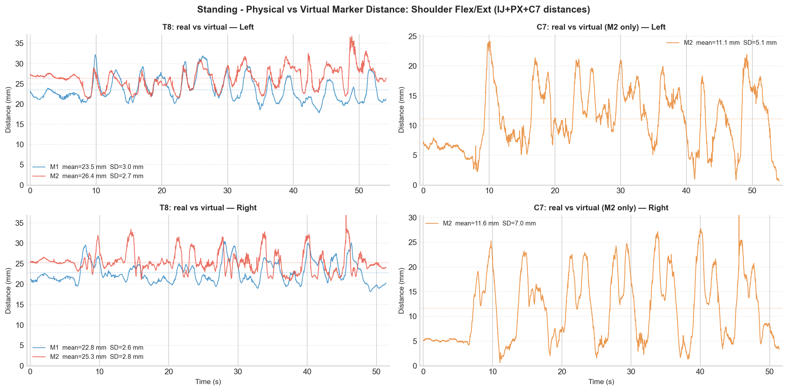
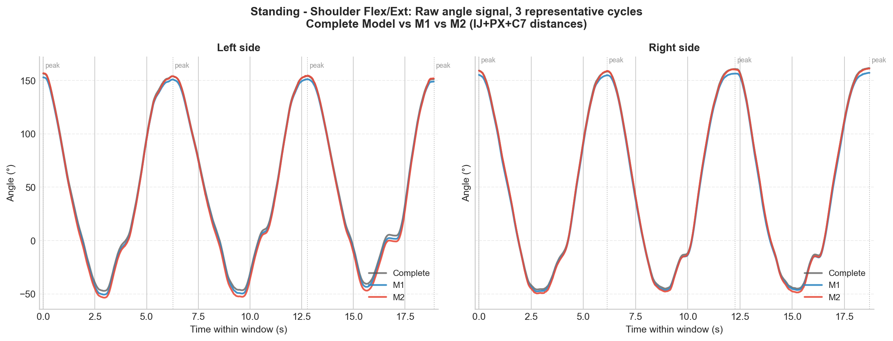

# Results Summary — Intermodel Comparison (grab7)

> Condition **Standing**: M1 and M2 validated against Complete Model (gold standard) via Comparison B.1 (Perfect distances) and B.2 (IJ\_PX\_C7 distances).
> Condition **Sitting**: inter-model agreement between M1 and M2 only (no gold standard available).
> Statistical metrics: bias (mean difference), SD, RMSD, ICC(C,1) with 95% CI. ICC thresholds follow Koo & Li (2016): < 0.50 poor, 0.50–0.75 moderate, 0.75–0.90 good, ≥ 0.90 excellent.
> Primary variable: **ROM (°)**. Peak and Valley results are in the full Excel sheets.

---

## Figures

### Figure 1 — ICC(C,1) for ROM: Standing, M1 and M2 vs Complete Model (B.1, Perfect distances)

**Caption.** ICC(C,1) for ROM between each kinematic model (M1, M2) and the Complete Model used as gold standard, under Perfect anatomical distances (Comparison B.1). Bars represent point estimates; error bars show 95% confidence intervals. Horizontal dashed lines indicate ICC threshold boundaries (Koo & Li, 2016). Left panel: Left side. Right panel: Right side. Bilateral movements appear only in the Left panel. Elbow Flex/Ext ICC = 1.000 for both models by design.

**Why this figure.** Central validation result of the standing condition. Summarises in a single image how well each model reproduces gold-standard ROM across all six movements and both sides. The side-by-side model comparison makes asymmetries immediately visible (e.g. M1 outperforms M2 for Thorax Lateral Inclination; both models agree on Elbow).

---

### Figure 2 — Mean ROM Difference vs Complete Model: Standing, all movements (B.1, Perfect distances)

**Caption.** Mean ROM difference (model − Complete Model, °) for each movement-side combination in the standing condition (Comparison B.1, Perfect distances). Circles: M1. Squares: M2. Error bars: ± 1 SD. Colour reflects ICC(C,1) interpretation (Koo & Li, 2016): green = excellent, orange = good, dark orange = moderate, red = poor. The vertical dashed line at zero indicates perfect agreement.

**Why this figure.** Provides a full-spectrum view of systematic bias for both models across all movements simultaneously — information that a single Bland-Altman plot cannot convey. It reveals that M1 biases are generally small (< 3°) except for Shoulder Abd/Add, while M2 carries a large systematic offset for Shoulder Flex/Ext (~4–7°) and Thorax Lateral Inclination (~9°). Combining this with ICC colour coding makes the distinction between "small bias + high agreement" (e.g. M1 Shoulder Flex/Ext) and "large bias + high agreement" (e.g. M2 Shoulder Flex/Ext) immediately legible.

---

### Figure 3 — Bland-Altman: Shoulder Flex/Ext ROM, Standing (M1 and M2 vs Complete Model, reference)

**Caption.** Bland-Altman plots for Shoulder Flexion/Extension ROM comparing M1 (top row) and M2 (bottom row) against the Complete Model, for Left and Right sides. Solid red line: mean bias. Dashed red lines: 95% limits of agreement (bias ± 1.96 SD). Each point is one repetition. Standing condition, Perfect distances.

**Why this figure.** Reveals the *nature* of the disagreement — not just its magnitude. For M1, bias is small (< 2.5°) and LoA are narrow. For M2, bias is large (~4–7°) but LoA remain narrow — a systematic offset, not random noise. This distinction is critical: M2 is reproducible but inaccurate in absolute terms. Shoulder Flex/Ext is chosen as the representative movement because it shows the clearest contrast between M1 and M2.

---

### Figure 4 — ICC(C,1) for ROM: Sitting, M1 vs M2

**Caption.** ICC(C,1) for ROM between M1 and M2 in the sitting condition. Blue bars: Left side. Green bars: Right side. Error bars show 95% CI. Bilateral movements appear only for the Left side. Threshold lines follow Koo & Li (2016).

**Why this figure.** In the sitting condition no gold standard is available, so the analysis is limited to inter-model agreement. Directly comparable in format to Figure 1, allowing qualitative cross-condition comparison.

---

### Figure 5 — Mean ROM Difference (M2 - M1): Sitting, all movements

**Caption.** Mean ROM difference M2 - M1 (°) for each movement-side combination in the sitting condition. Error bars: ± 1 SD. Annotations show the mean difference and ICC interpretation, colour-coded by Koo & Li category. The vertical dashed line at zero indicates perfect agreement.

**Why this figure.** Complements Figure 4 by adding the magnitude of disagreement. A movement can have excellent ICC (high reproducibility) but large mean difference (systematic offset) — this figure separates the two.

---

### Figure 6 — ROM cancellation effect: Peak RMSD vs ROM RMSD by anatomic distance condition (Comparison A)

**Caption.** Comparison A: RMSD between Perfect distances and each alternative anthropometric distance condition (IJ\_C7, PX\_C7, IJ\_PX\_C7) for Peak angle (solid bars) and ROM (hatched bars), for M1 (top) and M2 (bottom). Each group of bars corresponds to one movement-side combination. Where ROM RMSD bars are not visible, RMSD = 0.000°.

**Why this figure.** Makes the ROM cancellation effect visually explicit: for Shoulder Flex/Ext, Peak RMSD reaches ~3.3° (IJ\_C7) while ROM RMSD is exactly 0.000°. The anatomic distance condition introduces an equal offset to both Peak and Valley, which cancels in ROM = Peak − Valley. This justifies using ROM as the primary outcome variable and confirms that errors in anthropometric distances do not compromise the ROM comparison.

---

### Figure 7 - Physical vs Virtual Marker Distance: Shoulder Flex/Ext (IJ+PX+C7 distances)

**Caption.** Frame-by-frame 3D Euclidean distance (mm) between each physical marker and its virtual reconstruction during Shoulder Flexion/Extension (IJ+PX+C7 distance scenario). Left column: T8 virtual marker distance for M1 (blue) and M2 (red). Right column: C7 virtual marker distance for M2 only (M1 uses the real physical C7 marker). Dotted horizontal lines indicate the mean distance. Top row: Left side. Bottom row: Right side. Recording duration ~50 s (~7 repetitions).

**Why this figure.** Provides the mechanistic explanation for the angular biases observed in Comparison B.1. Two findings stand out. (1) T8 reconstruction error is similar for M1 and M2 (~23 mm and ~26 mm respectively), which is consistent with both models performing comparably on movements dominated by the thorax coordinate system. (2) The C7 virtual marker in M2 has a mean error of ~11 mm with high within-recording variability (SD 5-7 mm, range 0-24 mm). The distance oscillates rhythmically in phase with the movement cycle: each repetition shows approximately the same error at the peak angle and at the valley angle, so the rep-to-rep ROM error is nearly constant (SD = 0.52°, ICC = 0.990) even though the within-rep C7 position fluctuates. The 11 mm mean offset translates into the systematic ~7° ROM bias of M2 reported in Comparison B.1.

---

### Figure 8 - Temporal angle waveform: Shoulder Flex/Ext, 3 representative cycles

**Caption.** Raw humerothoracic angle signal during 3 representative cycles of Shoulder Flexion/Extension in standing (IJ+PX+C7 distances), selected from the middle of the continuous recording. Grey: Complete Model (reference). Blue: M1. Red: M2. Vertical dotted lines mark peak flexion instants detected on the reference signal. Left and Right panels correspond to the respective limbs.

**Why this figure.** Provides the qualitative reading that statistical tables cannot convey. Three observations are immediately visible: (1) all three models trace a nearly identical curve throughout the mid-range of each cycle, confirming that model differences are not pervasive across the full movement; (2) M2 (red) separates from the Complete Model at both extremes — valley (maximum extension, ~-50°) and peak (maximum flexion, ~150°) — and the separation is consistent rep after rep; (3) M1 (blue) remains visually indistinguishable from the Complete Model at all phases of the cycle. This pattern explains why the ROM bias of M2 is systematic (same offset at peak and valley → consistent ROM error) while the ICC remains excellent (the offset repeats identically each repetition).

---

## Tables

### Table 1 — Standing: ROM statistical metrics (Comparison B.1, Perfect distances)

Bias = model − Complete Model. Elbow Flex/Ext omitted (RMSD = 0.000°, ICC = 1.000 by design).

| Model | Movement | Side | n | Bias (°) | SD (°) | RMSD (°) | ICC | 95% CI | Interpretation |
|---|---|---|---|---|---|---|---|---|---|
| M1 | Elbow Flex/Ext | Left | 7 | 0.00 | 0.00 | 0.00 | 1.000 | [1.000, 1.000] | excellent |
| M1 | Elbow Flex/Ext | Right | 7 | 0.00 | 0.00 | 0.00 | 1.000 | [n/a, n/a] | excellent |
| M1 | Shoulder Abd/Add | Left | 7 | 5.09 | 1.57 | 5.29 | 0.840 | [0.330, 0.970] | good |
| M1 | Shoulder Abd/Add | Right | 7 | 7.20 | 0.87 | 7.25 | 0.979 | [0.880, 1.000] | excellent |
| M1 | Shoulder Flex/Ext | Left | 7 | -0.29 | 0.53 | 0.57 | 0.989 | [0.940, 1.000] | excellent |
| M1 | Shoulder Flex/Ext | Right | 7 | -2.47 | 0.33 | 2.49 | 0.996 | [0.980, 1.000] | excellent |
| M1 | Shoulder Int/Ext Rot | Left | 6 | -1.60 | 1.49 | 2.10 | 0.730 | [-0.050, 0.960] | moderate |
| M1 | Shoulder Int/Ext Rot | Right | 6 | -3.33 | 0.85 | 3.42 | 0.979 | [0.860, 1.000] | excellent |
| M1 | Thorax Lateral Inclination | Left | 8 | -1.62 | 1.48 | 2.13 | 0.880 | [0.520, 0.970] | good |
| M1 | Trunk Extended Lateral Inclination | Left | 8 | -0.11 | 0.33 | 0.33 | 0.859 | [0.450, 0.970] | good |
| M2 | Elbow Flex/Ext | Left | 7 | 0.00 | 0.00 | 0.00 | 1.000 | [1.000, 1.000] | excellent |
| M2 | Elbow Flex/Ext | Right | 7 | 0.00 | 0.00 | 0.00 | 1.000 | [n/a, n/a] | excellent |
| M2 | Shoulder Abd/Add | Left | 7 | -0.19 | 1.08 | 1.02 | 0.922 | [0.620, 0.990] | excellent |
| M2 | Shoulder Abd/Add | Right | 7 | 8.34 | 1.75 | 8.50 | 0.921 | [0.620, 0.990] | excellent |
| M2 | Shoulder Flex/Ext | Left | 7 | 6.88 | 0.52 | 6.89 | 0.990 | [0.940, 1.000] | excellent |
| M2 | Shoulder Flex/Ext | Right | 7 | 3.75 | 1.03 | 3.87 | 0.950 | [0.740, 0.990] | excellent |
| M2 | Shoulder Int/Ext Rot | Left | 6 | 2.69 | 2.04 | 3.27 | 0.667 | [-0.180, 0.950] | moderate |
| M2 | Shoulder Int/Ext Rot | Right | 6 | 3.34 | 1.25 | 3.53 | 0.953 | [0.710, 0.990] | excellent |
| M2 | Thorax Lateral Inclination | Left | 8 | -8.67 | 1.08 | 8.73 | 0.919 | [0.650, 0.980] | excellent |
| M2 | Trunk Extended Lateral Inclination | Left | 8 | -1.32 | 0.33 | 1.36 | 0.858 | [0.450, 0.970] | good |

---

### Table 2 — Standing: ROM statistical metrics (Comparison B.2, IJ\_PX\_C7 distances)

Sensitivity analysis of Table 1 using real anthropometric distances. ROM values for Shoulder Flex/Ext are identical to B.1 due to the cancellation effect.

| Model | Movement | Side | n | Bias (°) | SD (°) | RMSD (°) | ICC | 95% CI | Interpretation |
|---|---|---|---|---|---|---|---|---|---|
| M1 | Elbow Flex/Ext | Left | 7 | 0.00 | 0.00 | 0.00 | 1.000 | [1.000, 1.000] | excellent |
| M1 | Elbow Flex/Ext | Right | 7 | 0.00 | 0.00 | 0.00 | 1.000 | [n/a, n/a] | excellent |
| M1 | Shoulder Abd/Add | Left | 7 | 4.87 | 1.60 | 5.09 | 0.832 | [0.300, 0.970] | good |
| M1 | Shoulder Abd/Add | Right | 7 | 6.91 | 0.85 | 6.96 | 0.979 | [0.890, 1.000] | excellent |
| M1 | Shoulder Flex/Ext | Left | 7 | -0.29 | 0.53 | 0.57 | 0.989 | [0.940, 1.000] | excellent |
| M1 | Shoulder Flex/Ext | Right | 7 | -2.47 | 0.33 | 2.49 | 0.996 | [0.980, 1.000] | excellent |
| M1 | Shoulder Int/Ext Rot | Left | 6 | -1.60 | 1.49 | 2.10 | 0.730 | [-0.050, 0.960] | moderate |
| M1 | Shoulder Int/Ext Rot | Right | 6 | -3.33 | 0.85 | 3.42 | 0.979 | [0.860, 1.000] | excellent |
| M1 | Thorax Lateral Inclination | Left | 8 | -1.43 | 1.45 | 1.97 | 0.883 | [0.530, 0.980] | good |
| M1 | Trunk Extended Lateral Inclination | Left | 8 | -0.11 | 0.33 | 0.33 | 0.859 | [0.450, 0.970] | good |
| M2 | Elbow Flex/Ext | Left | 7 | 0.00 | 0.00 | 0.00 | 1.000 | [1.000, 1.000] | excellent |
| M2 | Elbow Flex/Ext | Right | 7 | 0.00 | 0.00 | 0.00 | 1.000 | [n/a, n/a] | excellent |
| M2 | Shoulder Abd/Add | Left | 7 | -0.51 | 1.10 | 1.14 | 0.919 | [0.600, 0.990] | excellent |
| M2 | Shoulder Abd/Add | Right | 7 | 8.07 | 1.70 | 8.22 | 0.925 | [0.630, 0.990] | excellent |
| M2 | Shoulder Flex/Ext | Left | 7 | 6.88 | 0.52 | 6.89 | 0.990 | [0.940, 1.000] | excellent |
| M2 | Shoulder Flex/Ext | Right | 7 | 3.75 | 1.03 | 3.87 | 0.950 | [0.740, 0.990] | excellent |
| M2 | Shoulder Int/Ext Rot | Left | 6 | 2.69 | 2.04 | 3.27 | 0.667 | [-0.180, 0.950] | moderate |
| M2 | Shoulder Int/Ext Rot | Right | 6 | 3.34 | 1.25 | 3.53 | 0.953 | [0.710, 0.990] | excellent |
| M2 | Thorax Lateral Inclination | Left | 8 | -7.22 | 1.15 | 7.30 | 0.909 | [0.620, 0.980] | excellent |
| M2 | Trunk Extended Lateral Inclination | Left | 8 | -1.32 | 0.33 | 1.36 | 0.858 | [0.450, 0.970] | good |

---

### Table 3 — Sitting: ROM statistical metrics (M1 vs M2)

Bias = M2 − M1. No gold standard; table reflects inter-model agreement only. Elbow Flex/Ext omitted.

| Movement | Side | n | Bias (°) | SD (°) | RMSD (°) | ICC | 95% CI | Interpretation |
|---|---|---|---|---|---|---|---|---|
| Elbow Flex/Ext | Left | 6 | 0.00 | 0.00 | 0.00 | n/a | [n/a, n/a] | nan |
| Elbow Flex/Ext | Right | 6 | 0.00 | 0.00 | 0.00 | n/a | [n/a, n/a] | nan |
| Shoulder Abd/Add | Left | 6 | -2.29 | 1.37 | 2.61 | 0.982 | [0.880, 1.000] | excellent |
| Shoulder Abd/Add | Right | 6 | -4.26 | 0.95 | 4.35 | 0.934 | [0.610, 0.990] | excellent |
| Shoulder Flex/Ext | Left | 7 | 5.87 | 1.56 | 6.04 | 0.789 | [0.190, 0.960] | good |
| Shoulder Flex/Ext | Right | 7 | 7.77 | 2.13 | 8.02 | 0.756 | [0.110, 0.950] | good |
| Shoulder Int/Ext Rot | Left | 7 | 0.81 | 2.01 | 2.03 | 0.698 | [-0.020, 0.940] | moderate |
| Shoulder Int/Ext Rot | Right | 7 | 5.70 | 2.16 | 6.04 | 0.897 | [0.520, 0.980] | good |
| Thorax Lateral Inclination | Left | 7 | -4.09 | 0.74 | 4.14 | 0.558 | [-0.250, 0.910] | moderate |
| Trunk Extended Lateral Inclination | Left | 7 | -0.70 | 0.16 | 0.72 | 0.993 | [0.960, 1.000] | excellent |

---

### Table 4 — Standing: ROM RMSD by anatomic distance condition (Comparison A)

RMSD (°) of ROM relative to Perfect distances. Elbow Flex/Ext and Shoulder Int/Ext Rot omitted (RMSD = 0.000° for all conditions and models). Shoulder Flex/Ext also omitted (RMSD = 0.000° — perfect cancellation).

| Model | Movement | Side | RMSD IJ\_C7 (°) | RMSD PX\_C7 (°) | RMSD IJ\_PX\_C7 (°) |
|---|---|---|---|---|---|
| M1 | Shoulder Flex/Ext | Left | 0.000 | 0.000 | 0.000 |
| M1 | Shoulder Flex/Ext | Right | 0.000 | 0.000 | 0.000 |
| M1 | Shoulder Abd/Add | Left | 0.284 | 0.177 | 0.231 |
| M1 | Shoulder Abd/Add | Right | 0.370 | 0.224 | 0.296 |
| M1 | Shoulder Int/Ext Rot | Left | 0.000 | 0.000 | 0.000 |
| M1 | Shoulder Int/Ext Rot | Right | 0.000 | 0.000 | 0.000 |
| M1 | Elbow Flex/Ext | Left | 0.000 | 0.000 | 0.000 |
| M1 | Elbow Flex/Ext | Right | 0.000 | 0.000 | 0.000 |
| M1 | Trunk Extended Lateral Inclination | Left | 0.000 | 0.000 | 0.000 |
| M1 | Thorax Lateral Inclination | Left | 0.322 | 0.143 | 0.223 |
| M2 | Shoulder Flex/Ext | Left | 0.000 | 0.000 | 0.000 |
| M2 | Shoulder Flex/Ext | Right | 0.000 | 0.000 | 0.000 |
| M2 | Shoulder Abd/Add | Left | 0.406 | 0.249 | 0.327 |
| M2 | Shoulder Abd/Add | Right | 0.339 | 0.208 | 0.274 |
| M2 | Shoulder Int/Ext Rot | Left | 0.000 | 0.000 | 0.000 |
| M2 | Shoulder Int/Ext Rot | Right | 0.000 | 0.000 | 0.000 |
| M2 | Elbow Flex/Ext | Left | 0.000 | 0.000 | 0.000 |
| M2 | Elbow Flex/Ext | Right | 0.000 | 0.000 | 0.000 |
| M2 | Trunk Extended Lateral Inclination | Left | 0.000 | 0.000 | 0.000 |
| M2 | Thorax Lateral Inclination | Left | 1.855 | 1.074 | 1.455 |

---

## General Conclusions

### Elbow Flex/Ext — insensitivity to the thorax model

Both M1 and M2 produce results identical to the Complete Model for Elbow Flex/Ext (bias = 0.000°, RMSD = 0.000°, ICC = 1.000) in all conditions. The elbow joint angle is computed in the humerus coordinate system and does not depend on the T8 or C7 markers reconstructed differently across models. This constitutes an internal validation of the analysis pipeline.

### ROM cancellation effect — why ROM is more robust than Peak or Valley

For movements where the thorax CS affects angle computation (principally Shoulder Flex/Ext), the anatomical distance condition introduces a near-uniform additive offset to both Peak and Valley values. Because ROM = Peak − Valley, this offset cancels exactly. The contrast is striking: for Shoulder Flex/Ext, switching from Perfect to IJ\_C7 distances produces a Peak RMSD of **3.31°**, while the corresponding ROM RMSD is **0.000°** (Figure 5). For Shoulder Int/Ext Rot the effect is complete (T8\_V coplanarity constraint), and for the remaining movements RMSD of ROM under the worst condition (IJ\_C7) reaches a maximum of **1.86°** (Thorax Lateral Inclination / M2 — clinically negligible given that the ICC remains 0.998, excellent). This result justifies using ROM as the primary outcome variable and validates the use of real anthropometric distances without meaningful loss of accuracy.

### M1 (C7 physical, T8 virtual)

M1 achieves **excellent** ROM agreement with the Complete Model for the majority of movements:

- **Shoulder Flex/Ext**: ICC > 0.989 (both sides); RMSD < 2.5°; bias < 2.5°.
- **Shoulder Abd/Add**: ICC 0.832–0.979 for ROM. Significant systematic bias (~5–7°) indicating a consistent offset from the T8 virtual reconstruction, reproducible across repetitions.
- **Shoulder Int/Ext Rot**: ROM ICC 0.730 (moderate) on the left side, 0.979 (excellent) on the right — the most asymmetric result and weakest performance.
- **Trunk Extended Lateral Inclination**: ICC 0.859 (good); bias < 0.11°.
- **Thorax Lateral Inclination**: ICC 0.880 (good); RMSD 2.13°; bias −1.62°.

M1 is a viable alternative to the Complete Model for ROM estimation in most movements.

### M2 (C7 virtual, NOT\_C7)

M2 shows a consistent pattern — **high ICC but large systematic bias** — where the virtual C7 contributes to the thorax CS:

- **Shoulder Flex/Ext**: ICC excellent (0.950–0.990) but bias 3.75–6.88°.
- **Shoulder Abd/Add**: ICC excellent; bias up to 8.34°.
- **Shoulder Int/Ext Rot**: ICC moderate–excellent; one poor ICC case (Right Valley, 0.498).
- **Thorax Lateral Inclination**: ICC 0.919 but bias −8.67° — the largest absolute error in the dataset.
- **Trunk Extended Lateral Inclination**: ICC 0.858 (good), bias −1.32° — acceptable.

The high ICC despite large bias means M2 errors are **systematic, not random**: the model is internally reproducible but introduces a measurable inaccuracy in absolute ROM. M2 should not be used when absolute ROM values are compared against normative data. It may be acceptable for within-session relative comparisons.

### Comparison B.1 vs B.2 — insensitivity of ROM to anthropometric distances

Comparing B.1 (Perfect) and B.2 (IJ\_PX\_C7) reveals near-identical ROM ICC and RMSD for all movements. Maximum ICC difference between B.1 and B.2 across all combinations is < 0.01 for ROM. Errors in anthropometric distance estimates do not propagate to ROM.

### Sitting — M1 vs M2 inter-model agreement

Without a gold standard, the analysis characterises inter-model consistency:

- **Trunk Extended Lateral Inclination**: near-perfect agreement (ICC = 0.993, RMSD < 0.72°).
- **Shoulder Abd/Add ROM**: excellent ICC (Left 0.982, Right 0.934); biases < 4.3°.
- **Shoulder Flex/Ext ROM**: good ICC (0.756–0.789) but large biases (5.87°–7.77°) — same systematic offset as in standing.
- **Shoulder Int/Ext Rot ROM**: moderate to good (ICC 0.698–0.897).
- **Thorax Lateral Inclination ROM**: moderate ICC (0.558), bias −4.09° — most problematic, consistent with standing results.

The sitting results reinforce the standing conclusions: movements with large M1/M2 discrepancy in standing also show the largest inter-model disagreement in sitting, confirming the differences are structural (C7 virtual reconstruction) rather than condition-specific.

### Summary statement

M1 is recommended over M2 when accurate absolute ROM values are required, particularly for shoulder and thorax movements. The virtual C7 reconstruction in M2 introduces systematic biases of 4–9° for movements most dependent on the thorax coordinate system origin. Both models produce perfect agreement for Elbow Flex/Ext. ROM is robust to errors in anthropometric distances (cancellation effect), making it the appropriate primary outcome variable in this analysis framework.
